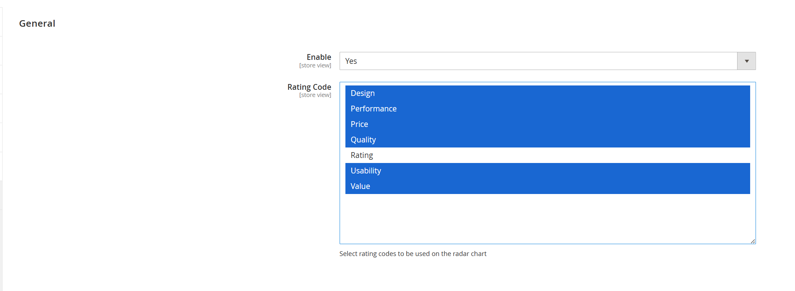
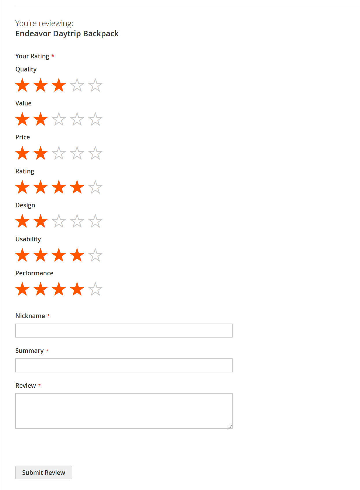
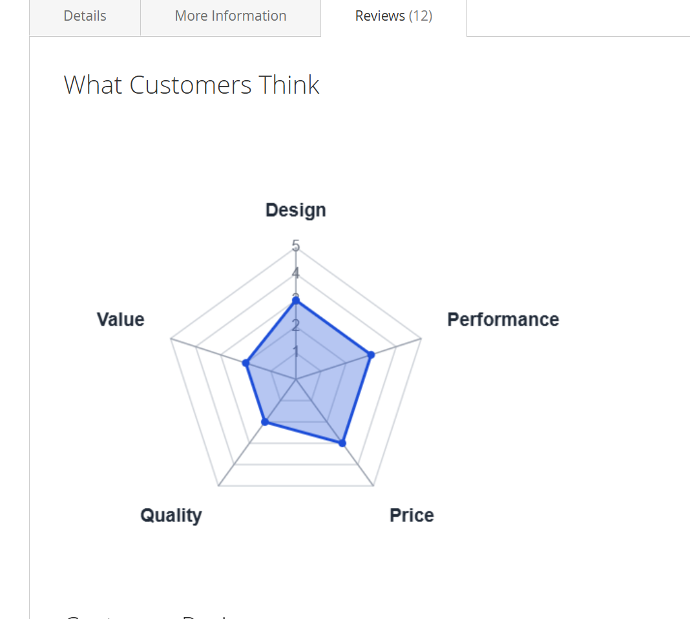

# Hmh_ReviewChart

Magento 2 module that adds a customer-facing radar chart to the product review section.

## Overview

This module reads selected Magento review rating codes from system configuration, calculates the average score for each configured rating, and renders a radar chart above the AJAX-loaded product review list.

The chart is only rendered when:

- `Hmh > Review Chart > Enable` is enabled
- Magento review is enabled via `catalog/review/active`
- at least 3 rating codes are configured
- at least 3 averaged rating values are available for the current product

## Requirements

- PHP `>= 8.1`
- `magento/module-review`

## Installation

Install the module in `app/code/Hmh/ReviewChart`, then run:

```bash
bin/magento module:enable Hmh_ReviewChart
bin/magento setup:upgrade
bin/magento cache:flush
```

If static assets are cached or deployed in production mode, also run:

```bash
bin/magento setup:static-content:deploy
```

## Configuration

Admin path:

`Stores > Configuration > HMH > Review Chart`

Available settings:

- `General > Enable`
- `General > Rating Code`
- `Advanced > Max Value`
- `Advanced > Canvas Width`
- `Advanced > Canvas Height`
- `Advanced > Center X`
- `Advanced > Radius`
- `Advanced > Label Offset`
- `Advanced > Axis Label Font Size`
- `Advanced > Axis Label Color`
- `Advanced > Scale Label Font Size`
- `Advanced > Scale Label Color`
- `Advanced > Data Fill Color`
- `Advanced > Data Fill Opacity`
- `Advanced > Data Stroke Color`
- `Advanced > Data Point Color`
- `Advanced > Point Radius`

`Rating Code` is a multiselect of Magento review rating codes. These are used as the radar chart axes.

The `Advanced` group controls the chart presentation:

- size and positioning of the canvas and radar shape
- font sizing for axis and scale labels
- label, fill, stroke, and point colors
- radar fill opacity

Color fields use a color picker in admin. `Data Fill Opacity` accepts a decimal value between `0` and `1`.

## How It Works

1. Set up review ratings in Magento at `Stores > Attributes > Rating`.
2. Create the rating attributes you want customers to score, for example `Quality`, `Value`, or `Durability`.
3. Go to `Stores > Configuration > HMH > Review Chart`.
4. Enable the module.
5. Select the rating codes you want to use in the radar chart.
6. Optionally adjust the `Advanced` style settings to match your storefront design.

For best results, configure at least 3 rating attributes so the radar chart is meaningful.

The module then:

- loads the selected rating codes from system configuration
- calculates the average score for each selected rating on the current product
- converts each average to an integer score on a `1-5` scale
- renders the radar chart above the product review list when enough data exists

## Screenshots

### Admin Configuration

Enable the module and choose the review rating attributes that should be included in the radar chart.



### Customer Rating Input

Customers submit product reviews using the configured rating attributes.



### Frontend Output

Radar chart shown above the product review list using the selected review rating attributes.


